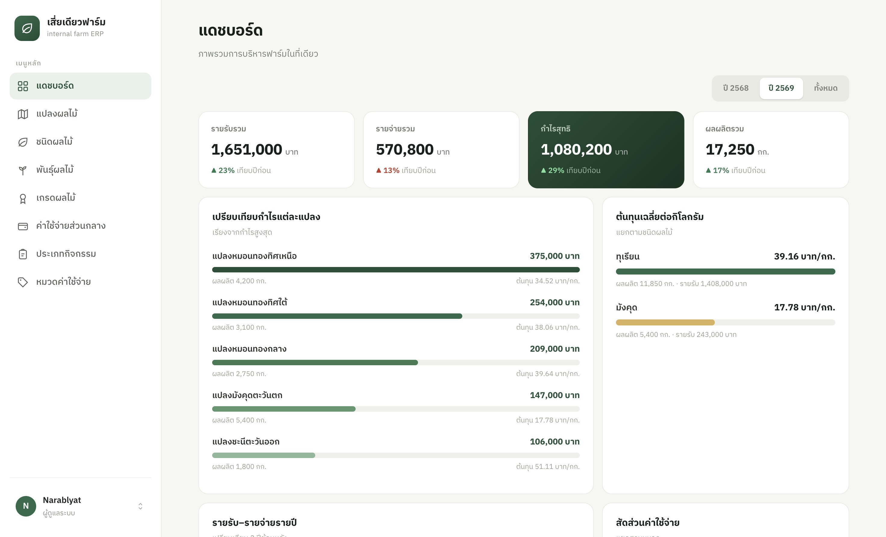
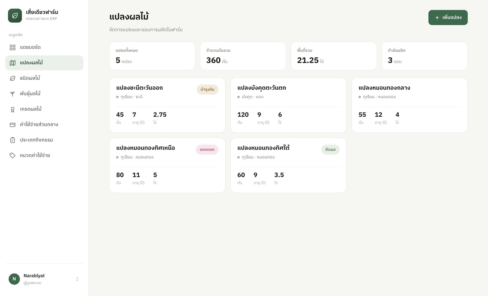
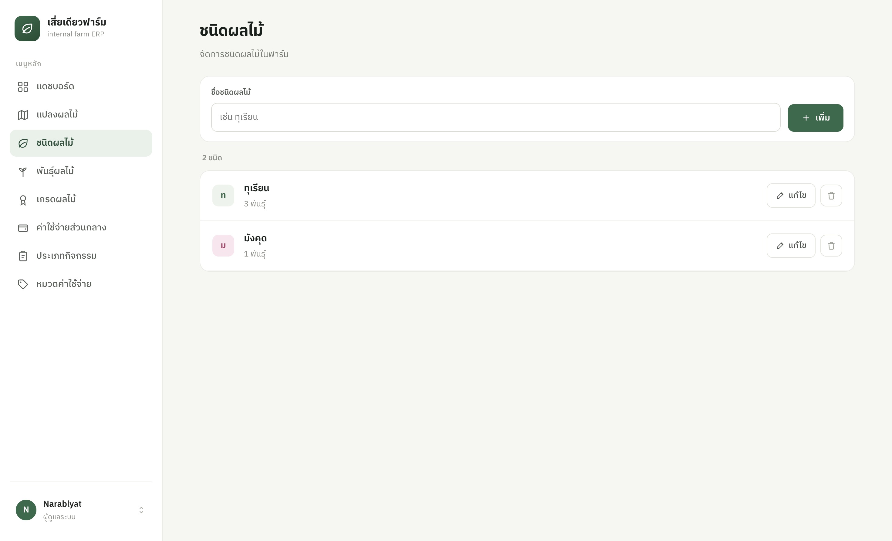
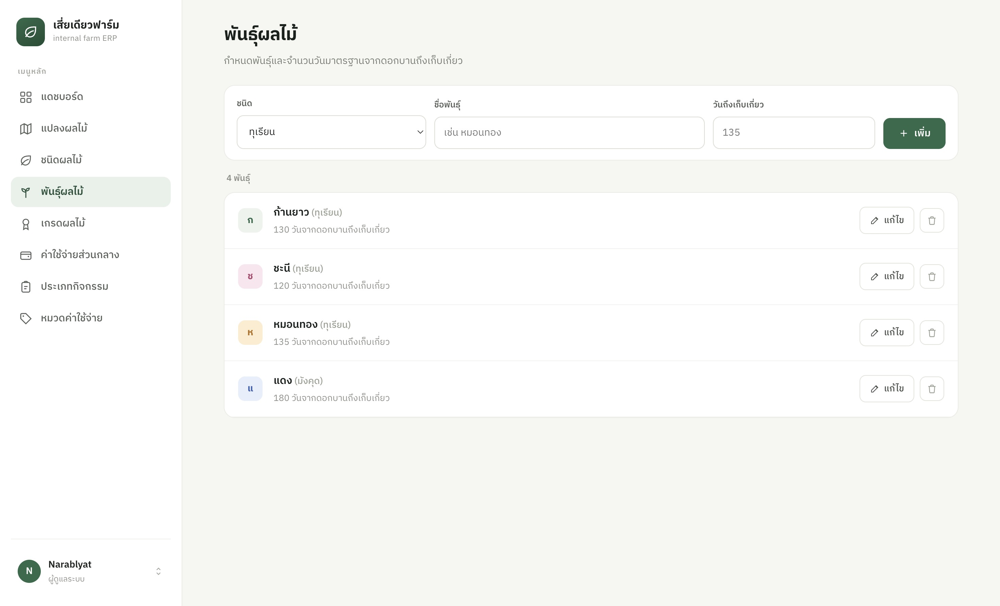
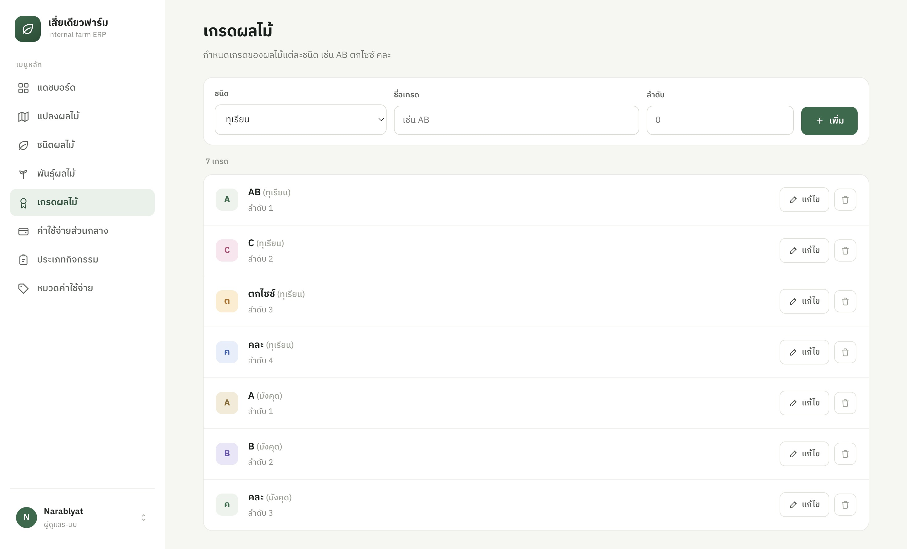
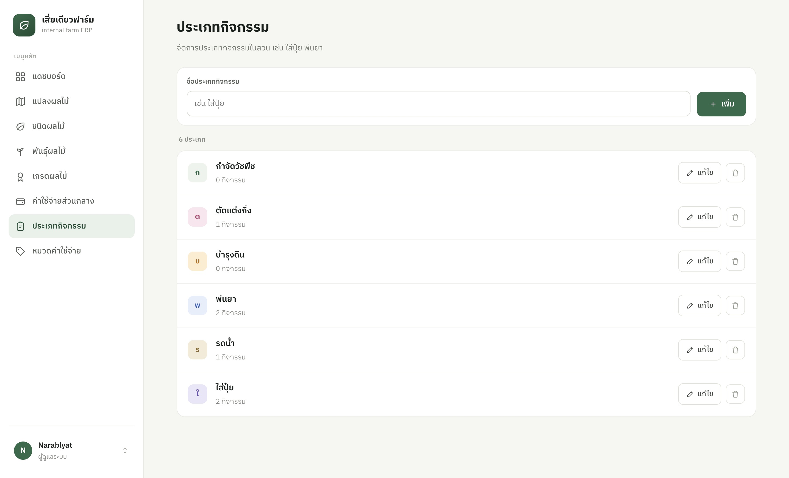
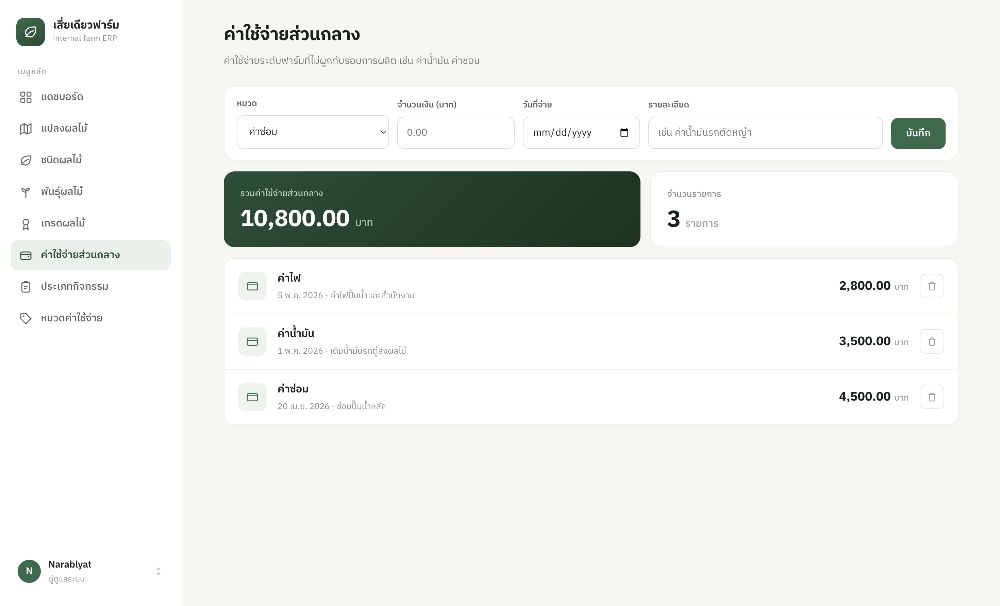
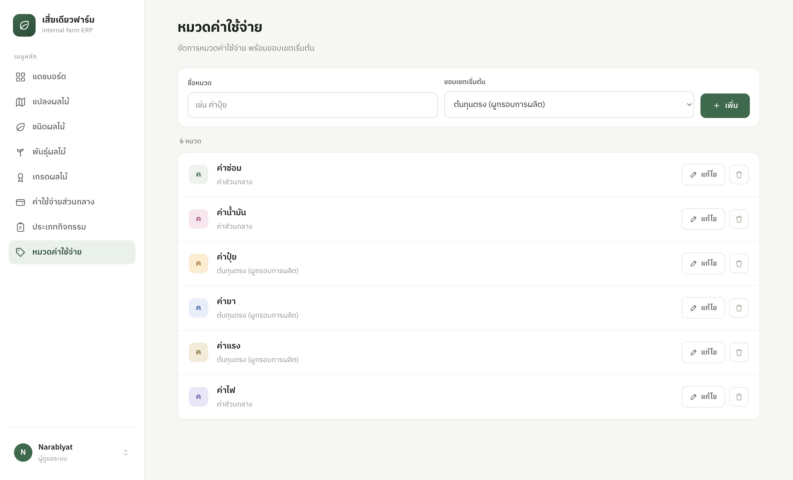

# Sia Diao Farm

A personal farm management app built for tracking a family fruit orchard. This is a hobby project — not production-grade software, but it works well enough for daily use in the field.

Feel free to fork it and adapt it for your own farm. No license restrictions.

## About

Sia Diao Farm (เสี่ยเดียวฟาร์ม) is an internal ERP for a small fruit orchard. It replaces paper notebooks with a mobile-friendly web app for recording what happens on each plot — from bloom to harvest to sale.

**Core features:**
- Fruit types, varieties, and quality grades
- Plot management with crop cycle tracking
- Activity logging (pruning, fertilizing, spraying, etc.)
- Harvest recording with per-grade line items
- Sale and expense tracking
- Basic yield and revenue analytics per crop cycle

The UI is Thai-only.

## Screenshots

| Dashboard | Orchard / Plot |
|-----------|---------------|
|  |  |

| Fruit Types | Fruit Varieties |
|-------------|-----------------|
|  |  |

| Grades | Activity Types |
|--------|----------------|
|  |  |

| Expenses | Expense Categories |
|----------|--------------------|
|  |  |

## Tech Stack

- **Backend:** Laravel 13, PHP 8.3, SQLite
- **Frontend:** React 19, Inertia.js v3, Tailwind CSS v4
- **Auth:** Laravel Fortify
- **Testing:** Pest v4

## Getting Started

**Requirements:** PHP 8.3+, Composer, Node.js 20+

```bash
# 1. Clone
git clone https://github.com/your-username/sia-diao-farm.git
cd sia-diao-farm

# 2. Environment
cp .env.example .env

# 3. PHP dependencies
composer install

# 4. Generate app key
php artisan key:generate

# 5. Database — creates SQLite file, runs migrations, seeds demo data
php artisan migrate --seed

# 6. Frontend
npm install
npm run build

# 7. Start
php artisan serve
```

Open [http://localhost:8000](http://localhost:8000) and log in with the seeded admin account:

| Field    | Value                          |
|----------|--------------------------------|
| Email    | value of `SEED_ADMIN_EMAIL` in `.env` |
| Password | `password`                     |

## Dev Mode

```bash
composer run dev
```

Starts the Laravel server, Vite dev server, and Pail log viewer together.

## Running Tests

```bash
php artisan test --compact
```
