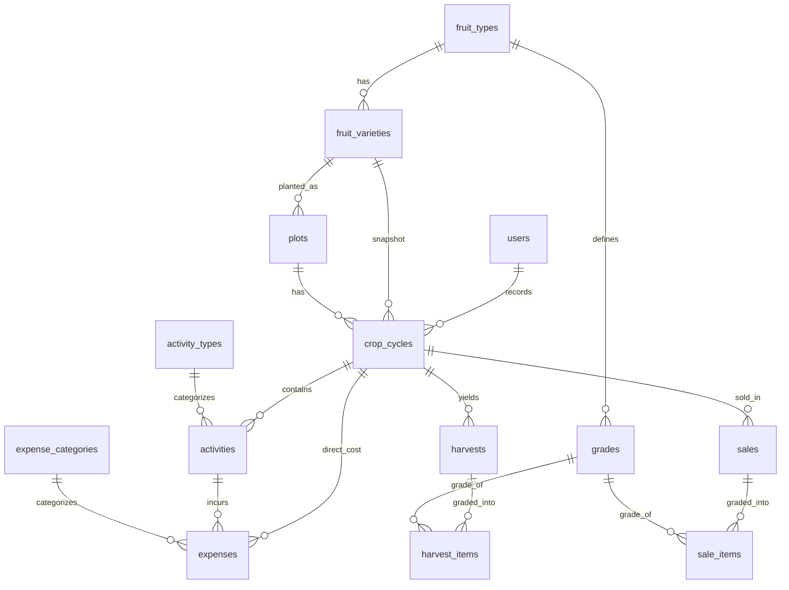

# เสี่ยเดียวฟาร์ม — Data Model Design (ERP สวนผลไม้)

วันที่: 2026-06-27
สถานะ: รออนุมัติ (Spec)
ขอบเขตเอกสารนี้: ออกแบบ **โครงสร้างข้อมูลรวม (unified data model)** ของทั้ง 4 โมดูล + ระบบสิทธิ์ เพื่อใช้เป็นฐานก่อนลงรายละเอียดทีละโมดูล

---

## 1. บริบทและเป้าหมาย

แอปพลิเคชัน ERP สำหรับฟาร์มสวนผลไม้ (ทุเรียน/มะม่วง) ของธุรกิจครอบครัว เน้นใช้งานบนมือถือเดินดูรอบสวน แก้ 3 ปัญหาหลัก:

1. **ไม่รู้ต้นทุนที่แท้จริง** — ลงเงินค่าปุ๋ย/ยา/แรงไปเรื่อยๆ ไม่รู้แปลงไหนกำไร/ขาดทุน
2. **คาดการณ์ผลผลิตยาก** — จำไม่ได้ว่าแปลงไหนทำอะไรวันไหน ดอกบานเมื่อไหร่ กะวันเก็บเกี่ยวคลาดเคลื่อน
3. **ข้อมูลกระจัดกระจาย** — จดสมุดบ้าง จำเอาบ้าง สมุดหายข้อมูลหาย

### โมดูลหลัก 4 โมดูล (สร้างทีละโมดูลตามลำดับ dependency)

1. จัดการโครงสร้างสวน (Farm Plot Management)
2. บันทึกกิจกรรมและต้นทุน (Activity & Expense Tracking)
3. ติดตามผลผลิตและการพยากรณ์ (Yield Tracking & Forecasting)
4. สรุปภาพรวมฟาร์ม (Farm Insights & Analytics)

ลำดับการสร้าง: Foundation/Master + โมดูล 1 → โมดูล 2 → โมดูล 3 → โมดูล 4 (แต่ละโมดูลมี spec/plan/implement ของตัวเอง)

---

## 2. การตัดสินใจเชิงออกแบบที่ยืนยันแล้ว

| # | ประเด็น | ผลสรุป |
|---|---|---|
| 1 | ลำดับงาน | ออกแบบ data model รวมทั้ง 4 โมดูลก่อน แล้วค่อยลงรายละเอียดทีละโมดูล |
| 2 | แกนกลาง | มี entity **"รอบการผลิต (Crop Cycle)"** ผูก 1 แปลง 1 รอบ; กิจกรรม/ค่าใช้จ่าย/เก็บเกี่ยว/ขาย ผูกกับรอบ |
| 3 | ข้อมูลผลไม้ | แยก **ชนิด (fruit_types)** และ **พันธุ์ (fruit_varieties)**; เก็บ `days_to_harvest` ที่ระดับพันธุ์ |
| 4 | ค่าใช้จ่าย | แยก direct (ผูกรอบ) vs overhead (ผูกฟาร์ม); v1 คิดต้นทุนตรงต่อกก., schema รองรับการเฉลี่ยภายหลัง |
| 5 | เก็บเกี่ยว vs ขาย | แยกตารางกัน (น้ำหนัก/เกรด แยกจาก ราคา/ผู้ซื้อ/วันที่) |
| 6 | เกรด | กำหนดเองต่อชนิดผลไม้ (`grades.fruit_type_id`) |
| 7 | ปัจจัยการผลิต | แบบเบา — กิจกรรมมี ประเภท + โน้ตบรรยาย + รายการค่าใช้จ่าย (ไม่มีตารางวัสดุ/สต็อกใน v1) |
| 8 | สถาปัตยกรรม | แนวทาง A (Normalized, line-item แยกตาราง) |
| 9 | สิทธิ์ | 2 role: `admin` (ระบบ+ผู้ใช้), `user` (ปฏิบัติงานฟาร์มเต็มที่); ไม่มี role คนงานรับจ้างใน v1 |

---

## 3. ภาพรวมความสัมพันธ์ (ERD)

---

## 4. ข้อมูลหลัก (Master Data)

จัดการได้โดย `admin` และ `user`

### `fruit_types` — ชนิดผลไม้
| ฟิลด์ | ชนิด | หมายเหตุ |
|---|---|---|
| `id` | bigint PK | |
| `name` | string | เช่น ทุเรียน, มะม่วง |
| `timestamps` | | |

### `fruit_varieties` — พันธุ์
| ฟิลด์ | ชนิด | หมายเหตุ |
|---|---|---|
| `id` | bigint PK | |
| `fruit_type_id` | FK → fruit_types | |
| `name` | string | เช่น หมอนทอง, น้ำดอกไม้ |
| `days_to_harvest` | unsignedInteger | จำนวนวันมาตรฐานจากดอกบานถึงเก็บเกี่ยว ใช้พยากรณ์ |
| `timestamps` | | |

### `grades` — เกรดผลไม้ (กำหนดเองต่อชนิด)
| ฟิลด์ | ชนิด | หมายเหตุ |
|---|---|---|
| `id` | bigint PK | |
| `fruit_type_id` | FK → fruit_types | |
| `name` | string | เช่น AB, ตกไซซ์, คละ |
| `sort_order` | unsignedInteger | ลำดับการแสดงผล |
| `timestamps` | | |

### `activity_types` — ประเภทกิจกรรม
| ฟิลด์ | ชนิด | หมายเหตุ |
|---|---|---|
| `id` | bigint PK | |
| `name` | string | เช่น ใส่ปุ๋ย, พ่นยา, รดน้ำ, ตัดแต่งกิ่ง |
| `timestamps` | | |

### `expense_categories` — หมวดค่าใช้จ่าย
| ฟิลด์ | ชนิด | หมายเหตุ |
|---|---|---|
| `id` | bigint PK | |
| `name` | string | เช่น ค่าปุ๋ย, ค่ายา, ค่าแรง, ค่าน้ำมัน, ค่าซ่อม |
| `default_scope` | enum(`direct`,`overhead`) | ค่าเริ่มต้นช่วยกรอก ไม่ใช่ข้อบังคับ |
| `timestamps` | | |

---

## 5. ตารางแกนกลาง

### `plots` — แปลง
| ฟิลด์ | ชนิด | หมายเหตุ |
|---|---|---|
| `id` | bigint PK | |
| `name` | string | เช่น แปลงทุเรียนทิศเหนือ |
| `fruit_variety_id` | FK → fruit_varieties | พันธุ์ปัจจุบันที่ปลูกในแปลง |
| `tree_count` | unsignedInteger | จำนวนต้น |
| `planted_at` | date nullable | วันที่ปลูก — ใช้คำนวณอายุต้นไม้ (ไม่เก็บตัวเลขอายุที่จะ outdated) |
| `area_rai` | decimal nullable | พื้นที่ (ไร่) เผื่อใช้เฉลี่ยต้นทุนในอนาคต |
| `notes` | text nullable | |
| `timestamps` | | |

### `crop_cycles` — รอบการผลิต (แกนกลาง)
| ฟิลด์ | ชนิด | หมายเหตุ |
|---|---|---|
| `id` | bigint PK | |
| `plot_id` | FK → plots | |
| `fruit_variety_id` | FK → fruit_varieties | snapshot จากแปลงตอนสร้างรอบ (กันประวัติเพี้ยนหากเปลี่ยนพันธุ์ภายหลัง) |
| `label` | string | เช่น "รอบ 2569" |
| `stage` | enum | สถานะรอบ: บำรุงดิน/ออกดอก/ติดผล/พร้อมเก็บเกี่ยว/เก็บเกี่ยวแล้ว |
| `flowering_date` | date nullable | วันดอกบาน/ติดผล |
| `expected_harvest_date` | date nullable | คำนวณ = `flowering_date` + `fruit_varieties.days_to_harvest` |
| `status` | enum(`active`,`closed`) | |
| `started_at` | date | |
| `closed_at` | date nullable | |
| `recorded_by` | FK → users | |
| `notes` | text nullable | |
| `timestamps` | | |

**กฎ:**
- สถานะปัจจุบันของแปลง = `stage` ของรอบที่ `active` (ไม่เก็บ status ซ้ำบนแปลง)
- `expected_harvest_date` คำนวณอัตโนมัติเมื่อบันทึก `flowering_date`

---

## 6. ตารางบันทึกธุรกรรม (Transactional)

### `activities` — กิจกรรม
| ฟิลด์ | ชนิด | หมายเหตุ |
|---|---|---|
| `id` | bigint PK | |
| `crop_cycle_id` | FK → crop_cycles | |
| `activity_type_id` | FK → activity_types | |
| `performed_on` | date | |
| `notes` | text nullable | เช่น "ปุ๋ยสูตร 15-15-15 2 กระสอบ" |
| `recorded_by` | FK → users | |
| `timestamps` | | |

### `expenses` — ค่าใช้จ่าย (รองรับทั้ง direct และ overhead)
| ฟิลด์ | ชนิด | หมายเหตุ |
|---|---|---|
| `id` | bigint PK | |
| `expense_category_id` | FK → expense_categories | |
| `amount` | decimal | บาท |
| `spent_on` | date | |
| `description` | string nullable | |
| `crop_cycle_id` | FK nullable → crop_cycles | **มีค่า = direct cost, null = overhead** |
| `activity_id` | FK nullable → activities | ผูกเมื่อค่าใช้จ่ายมาจากกิจกรรม |
| `recorded_by` | FK → users | |
| `timestamps` | | |

**กฎการแยกค่าใช้จ่าย:**
- **direct:** `crop_cycle_id` มีค่า (มักผูก `activity_id` ด้วย) → คิดเข้าต้นทุนรอบ/แปลง
- **overhead:** `crop_cycle_id` = null → ไม่เข้าต้นทุนแปลงใน v1 แต่รวมในกำไรรวมฟาร์ม
- รองรับ "เฉลี่ย overhead ลงแปลง" ในอนาคตได้โดยไม่แก้ schema

### `harvests` — การเก็บเกี่ยว
| ฟิลด์ | ชนิด | หมายเหตุ |
|---|---|---|
| `id` | bigint PK | |
| `crop_cycle_id` | FK → crop_cycles | |
| `harvested_on` | date | |
| `notes` | text nullable | |
| `recorded_by` | FK → users | |
| `timestamps` | | |

### `harvest_items` — รายการเก็บเกี่ยวตามเกรด
| ฟิลด์ | ชนิด | หมายเหตุ |
|---|---|---|
| `id` | bigint PK | |
| `harvest_id` | FK → harvests | |
| `grade_id` | FK → grades | |
| `weight_kg` | decimal | |
| `timestamps` | | |

### `sales` — การขาย
| ฟิลด์ | ชนิด | หมายเหตุ |
|---|---|---|
| `id` | bigint PK | |
| `crop_cycle_id` | FK → crop_cycles | |
| `buyer_name` | string | พ่อค้า/ล้ง |
| `sold_on` | date | |
| `notes` | text nullable | |
| `recorded_by` | FK → users | |
| `timestamps` | | |

### `sale_items` — รายการขายตามเกรด
| ฟิลด์ | ชนิด | หมายเหตุ |
|---|---|---|
| `id` | bigint PK | |
| `sale_id` | FK → sales | |
| `grade_id` | FK → grades | |
| `weight_kg` | decimal | |
| `price_per_kg` | decimal | |
| `subtotal` | decimal | = `weight_kg × price_per_kg` (เก็บไว้กันปัญหาปัดเศษ) |
| `timestamps` | | |

**กฎ:** น้ำหนักเก็บเกี่ยว (harvest) กับน้ำหนักขาย (sale) ไม่จำเป็นต้องเท่ากัน (เผื่อทานเอง/แจก/เน่าเสีย)

---

## 7. การคำนวณ Analytics

ไม่มีตารางใหม่ใน v1 — คำนวณสดด้วย Eloquent/SQL (ข้อมูลฟาร์มครอบครัวไม่ใหญ่); หากโตค่อยเพิ่ม cache/summary ภายหลังโดยไม่กระทบ schema

### ต่อ 1 รอบการผลิต
| ตัวเลข | สูตร |
|---|---|
| ผลผลิตรวม (กก.) | `SUM(harvest_items.weight_kg)` ของรอบ |
| รายรับ (บาท) | `SUM(sale_items.subtotal)` ของรอบ |
| ต้นทุนตรง (บาท) | `SUM(expenses.amount)` ที่ `crop_cycle_id` = รอบ |
| **ต้นทุนเฉลี่ยต่อกก.** | ต้นทุนตรง ÷ ผลผลิตรวม (ใช้น้ำหนักเก็บเกี่ยวเป็นตัวหาร) |
| กำไรของรอบ | รายรับ − ต้นทุนตรง |

### ระดับฟาร์ม (ช่วงเวลา/ปี)
| ตัวเลข | สูตร |
|---|---|
| รายรับรวม | รวม `sale_items.subtotal` ทุกรอบในช่วง |
| รายจ่ายรวม | ต้นทุนตรงทุกรอบ + ค่าส่วนกลาง (`crop_cycle_id` null) |
| กำไรสุทธิ | รายรับรวม − รายจ่ายรวม |
| เปรียบเทียบแปลง | จัดอันดับกำไร/ต้นทุนต่อกก. per plot |

---

## 8. สิทธิ์การใช้งาน

เพิ่มฟิลด์ `role` ใน `users`: enum(`admin`, `user`) — ระบบปิด, admin สร้างบัญชีให้ (ไม่มีหน้าสมัครสมาชิกสาธารณะ)

| ความสามารถ | admin | user |
|---|---|---|
| จัดการผู้ใช้ (สร้าง/ลบบัญชี) | ✅ | ❌ |
| ตั้งค่าระบบ | ✅ | ❌ |
| จัดการข้อมูลหลัก (ชนิด/พันธุ์/เกรด/หมวดค่าใช้จ่าย/ประเภทกิจกรรม) | ✅ | ✅ |
| จัดการแปลง + รอบการผลิต | ✅ | ✅ |
| บันทึกกิจกรรม/ค่าใช้จ่าย/เก็บเกี่ยว/ขาย | ✅ | ✅ |
| ดู Dashboard กำไร/ต้นทุน/เปรียบเทียบแปลง | ✅ | ✅ |

บังคับใช้ด้วย Laravel Policies/Gates; ส่วนต่างจริงคือ "จัดการผู้ใช้ + ตั้งค่าระบบ" เท่านั้น

---

## 9. การแมปตารางกับโมดูล (ลำดับการสร้าง)

| โมดูล | ตารางที่เกี่ยวข้อง |
|---|---|
| Foundation/Master + โมดูล 1 | `users.role`, `fruit_types`, `fruit_varieties`, `grades`, `activity_types`, `expense_categories`, `plots`, `crop_cycles` |
| โมดูล 2 | `activities`, `expenses` |
| โมดูล 3 | `harvests`, `harvest_items`, `sales`, `sale_items` (+ ใช้ `flowering_date`/`expected_harvest_date` จาก crop_cycles) |
| โมดูล 4 | ไม่มีตารางใหม่ — query/aggregate จากข้อมูลข้างต้น |

---

## 10. นอกขอบเขต v1 (Future)

- ตารางวัสดุ/ปัจจัยการผลิต + การจัดการสต็อก (ปุ๋ย/ยาคงคลัง)
- การเฉลี่ยค่าใช้จ่ายส่วนกลางลงแปลง (schema รองรับแล้ว เหลือเพิ่ม logic)
- role คนงานรับจ้างที่จำกัดการเห็นข้อมูลการเงิน
- ตารางสรุป/cache สำหรับ analytics เมื่อข้อมูลใหญ่ขึ้น
